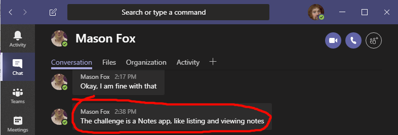

# Notes App

> Written in glorious QuickBASIC

## How do I run it?

1. Execute NOTES.EXE from a DOS shell
1. Follow instructions

## Features

1. List notes
1. View notes

Thats it!  As those were the only requirements ;)

